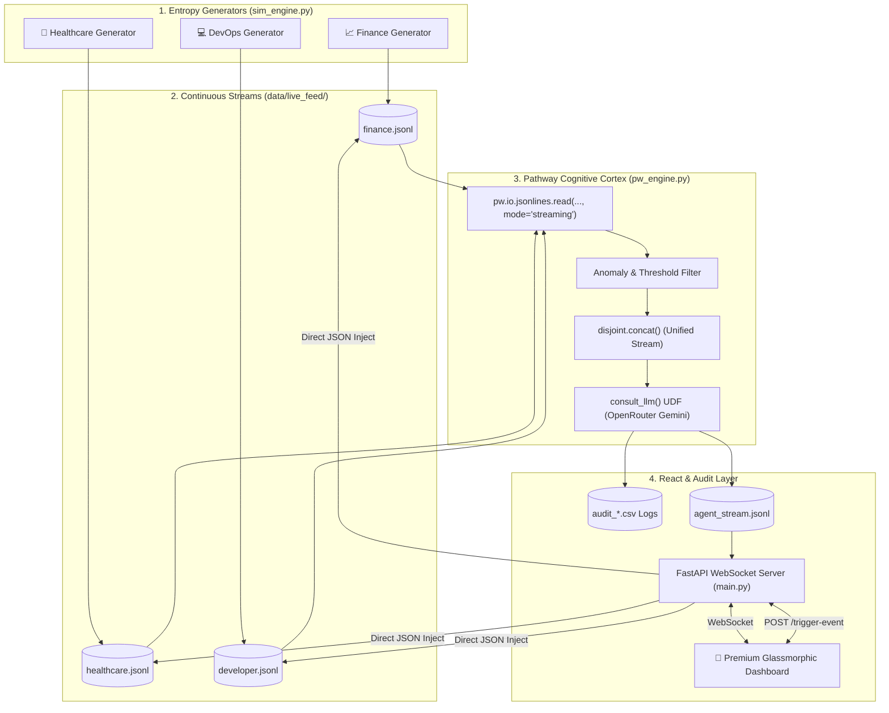

# Synaptix: The Agent That Never Sleeps 👁️

**A premium, hackathon-ready streaming agentic AI platform** combining Pathway's zero-batching streaming engine, OpenRouter (Gemini) cognitive anomaly detection, and a high-fidelity WebSocket-driven real-time reactor dashboard.

[](https://github.com/anugrahks19/synaptix)
[](https://python.org)
[](https://pathway.com)
[](https://opensource.org/licenses/MIT)

---

## 🎯 Overview

Most AI models are fossilized—frozen in the state of their last training run. Traditional Retrieval-Augmented Generation (RAG) systems suffer from **"Context Evaporation"** and require periodic batch indexing jobs that take minutes to sync. By the time they learn of a failure, the market has moved, the patient has crashed, or the server is dead.

**Synaptix is Kinetic.** It doesn't just query a database; it **lives** inside the live data stream. By leveraging **Pathway's Streaming Engine**, it achieves **0-Batching** and **<50ms processing latency** to analyze live data, detect anomalies, consult AI, and execute safety overrides in real-time.



### Key Features

*   **⚡ Pathway 0-Batching Engine**: Monitors stream files continuously. When a single byte hits the disk, Pathway processes it instantly, dropping latency from minutes to **milliseconds**.
*   **🧠 Cognitive Anomaly Detection**: Moves beyond brittle static rules. The agent understands context (e.g., *"The stock price dropped 50% but it's a planned stock split - do not panic"*).
*   **🛡️ Fail-Safe Safety Cortex**: Wraps the AI in an intelligent fallback system. If the LLM experiences network timeouts or API rate-limiting (429), it instantly triggers deterministic, pre-approved **"Reflex Actions"** (e.g., circuit breaker, IV administration, network isolation).
*   **🎭 Polymorphic Architecture**: One brain, three domains. Seamlessly shifts between **Finance Mode** (ticks & market volatility), **Healthcare Mode** (patient ICU vitals), and **DevOps Mode** (SLA breaches & infrastructure logs).
*   **🕹️ Live Control Room**: Customize alert thresholds (BPM, latency limits, drawdown percentage) or manually inject custom Black Swan events (Flash Crash, Cardiac Arrest, DDoS attack) to test system reflexes.
*   **💎 Premium Glassmorphic UI**: High-impact modern styling with frosted glass, harmony HSL palettes, real-time WebSocket charts, dynamic metrics, and rich animations.

---

## 🚀 Quick Start

### Prerequisites

*   **Python 3.9+** (For local execution)
*   **Docker & Docker Compose** (Recommended - handles Linux dependencies seamlessly)
*   **WSL (Windows Subsystem for Linux)** (If running Pathway locally on Windows without Docker)

---

### Method 1: Docker (Easiest & Fastest) 🐳

This is the recommended route because Pathway requires a Linux environment. Docker handles this configuration automatically.

1.  **Install and start** [Docker Desktop](https://www.docker.com/products/docker-desktop/).
2.  **Configure Environment Variables**:
    ```bash
    cp .env.example .env
    # Add your OpenRouter API key to the .env file
    ```
3.  **Run the startup batch script** (or run `docker-compose up --build`):
    ```bash
    run_docker.bat
    ```
4.  **Access the application**:
    *   Dashboard: **[http://localhost:8000](http://localhost:8000)**

---

### Method 2: Manual Local Mode (For Developers) 💻

If you want to view every isolated log stream, you can run the services manually in separate terminal windows.

#### Step 1: Install Dependencies
```bash
pip install -r requirements.txt
```

#### Step 2: Configure Environment Variables
```bash
cp .env.example .env
# Edit .env and enter your OPENROUTER_API_KEY
```

#### Step 3: Run the Triad (3 Terminals)

| Terminal | Module | Command | Environment | Purpose |
| :--- | :--- | :--- | :--- | :--- |
| **Terminal A** | **Simulation** | `python src/generators/sim_engine.py` | Local Host | Generates continuous streams |
| **Terminal B** | **API Server** | `python src/backend/main.py` | Local Host | Hosts FastAPI and WebSockets |
| **Terminal C** | **Pathway Engine** | `python3 src/backend/pw_engine.py` | **WSL/Linux (Required)** | High-speed cognitive processing |

#### Step 4: Open application
Open **[http://localhost:8000](http://localhost:8000)** in your browser.

---

## 🔐 Environment & Security Config

Configure your local environment by creating a `.env` file from the provided example:

```env
# OpenRouter API Key for Synaptix Agentic AI
# Get yours at https://openrouter.ai/keys
OPENROUTER_API_KEY=your_openrouter_api_key_here

# OpenRouter Model to use
# Default is Google Gemini 2.0 Flash Experimental (Free tier)
OPENROUTER_MODEL=google/gemini-2.0-flash-exp:free
```

> [!WARNING]
> Never commit your real `.env` file to source control. The repository is pre-configured with a `.gitignore` to prevent secret leaks of all `.env*` files except `.env.example`.

### Repository Security & gitignore Status
To prevent telemetry leaks and configuration noise, our repository has a strict, security-first configuration:
*   ✅ **Secrets Shielded**: Local environment configurations (`.env`, `.env.local`, etc.) are explicitly ignored.
*   ✅ **Clean Telemetry**: Live simulation data streams (`data/live_feed/*.jsonl`) and dynamic outputs (`data/agent_stream.jsonl`) are removed from Git tracking and ignored.
*   ✅ **Isolated Audits**: Temporary diagnostic outputs (`data/audit_*.csv`) are kept local-only to avoid version history bloat.

---

## 🎨 Technology Stack

### Backend & Streaming
*   **Pathway**: High-throughput, streaming ETL, and event-driven data engine.
*   **FastAPI**: Modern, fast (high-performance) web framework for building APIs.
*   **OpenAI Python SDK**: For interfacing with OpenRouter API.
*   **Uvicorn**: Lightning-fast ASGI web server implementation.
*   **Pydantic & Dotenv**: Data parsing, strict validation, and environment loading.

### Frontend
*   **Vanilla JavaScript**: Pure ES Modules, zero heavy frameworks, native WebSockets.
*   **Chart.js**: Dynamic, real-time responsive data visualization.
*   **CSS Custom Properties**: Sleek glassmorphism theme with custom animations.
*   **Google Fonts**: Inter, Outfit & JetBrains Mono typography.

---

## 📊 Cognitive Safety Cortex & Fallback Protocols

What happens when the LLM is overloaded, rate-limited, or goes offline? A critical system cannot simply freeze.

Synaptix is built with an **Enterprise-Grade Safety Cortex** wrapping the AI UDF. When the API returns a `429 Too Many Requests` or fails, the engine seamlessly triggers deterministic **"Reflex Actions"**:

| Domain | Event | Anomaly Indicator | Deterministic Reflex Action |
|:---|:---|:---|:---|
| **Finance** | `CRASH` | Volatility > 10% | `Circuit Breaker Tripped (Halt Trading)` |
| **Finance** | `Flash` | Immediate drawdown | `Injecting Liquidity (Stabilize)` |
| **Healthcare** | `CARDIAC` | Patient BPM = 0 | `Administering Epinephrine (Code Blue)` |
| **Healthcare** | `SEPSIS` | Temp Spike / vitals drop | `Starting IV Antibiotics (Sepsis Protocol)` |
| **DevOps** | `DDOS` | Traffic spike > 50M RPS | `Rerouting Traffic (Scrubbing Center)` |
| **DevOps** | `Ransomware` | File encryption flag | `Isolating Network Segment (Containment)` |

This hybrid system combines the cognitive reasoning of LLMs with the reliability of industrial-grade automatons.

---

## 🗂️ Project Structure

```
synaptix/
├── data/
│   ├── live_feed/              # RAW streaming inputs (JSONL format) [UNTRACKED]
│   │   ├── developer.jsonl     # Live DevOps log entries
│   │   ├── finance.jsonl       # Real-time stock ticks
│   │   └── healthcare.jsonl    # Patient vitals telemetry
│   ├── sim_config.json         # Real-time dashboard rules & status configuration
│   └── agent_stream.jsonl      # Pathway AI output read by FastAPI WebSockets [UNTRACKED]
│
├── src/
│   ├── backend/
│   │   ├── main.py             # FastAPI WebSocket gateway, static directories
│   │   └── pw_engine.py        # Pathway streaming engine and LLM agent reasoning
│   │
│   ├── generators/
│   │   └── sim_engine.py       # Multi-domain synthetic data simulation
│   │
│   └── frontend/
│       ├── index.html          # Gateway portal and landing page
│       ├── dashboard.html      # Glassmorphic WebSocket analytics console
│       ├── network.html        # Cognitive neural graph simulator
│       ├── forensics.html      # Anomaly logs & historical auditor
│       ├── app.js              # Native WebSocket controller and chart updating
│       └── style.css           # Custom glassmorphic styling system
│
├── .dockerignore               # Docker build filters
├── .env.example                # Blueprint for local configuration
├── .gitattributes              # Standard Git line-ending configs
├── .gitignore                  # Security-first ignore lists
├── Dockerfile                  # Multi-service image configuration
├── docker-compose.yml          # Container configuration for server, pathway, simulation
├── run_docker.bat              # One-click Windows runner
├── run_brain_wsl.sh            # WSL automated Pathway activator
├── requirements.txt            # Python dependencies
├── render.yaml                 # Render deployment configuration
├── start.sh                    # Container services orchestrator
├── HOW_IT_WORKS.md             # Theoretical physics & architecture guide
├── RUN_GUIDE.md                # Quickstart and deployment manual
└── SUBMISSION_REPORT.md        # Hackathon submission summary
```

---

## 🔌 API & WebSocket Endpoints

Synaptix operates with an event-driven API gateway that bridges WebSocket telemetry to on-disk buffer states.

### WebSocket Interface
*   **`WS /ws`**
    *   **Description**: Establishes a persistent client connection.
    *   **Inbound Messages**: Accept `"analyze"` keyword to command immediate RAG analysis.
    *   **Outbound Broadcasts**:
        *   `{"type": "data_update", "data": ...}`: Instant pushes of new simulated ticks/vitals/syslogs.
        *   `{"type": "agent_response", "content": ...}`: Real-time agent analysis thoughts and reflex actions formulated by Pathway.

### REST Endpoints
*   **`POST /trigger-event`**
    *   **Payload**: `{"domain": "finance" | "healthcare" | "dev"}`
    *   **Description**: Manually injects a Black Swan scenario into the active JSONL file, demonstrating instant Pathway reaction.
*   **`POST /update-rules`**
    *   **Payload**: `{"type": "finance" | "health" | "dev", "max_bpm": int, "max_drawdown": int, "max_latency": int}`
    *   **Description**: Updates thresholds dynamically in `sim_config.json`, which the simulator picks up on the next cycle.
*   **`POST /stabilize`**
    *   **Description**: Forces the simulation out of `CHAOS` mode, injecting normal data payloads to return all monitored domains to stability.
*   **`GET /dashboard`** / **`GET /network`** / **`GET /forensics`**
    *   **Description**: Serves index portal, analytics console, neural graph visualizer, and audit trace tables.

---

## 🏗️ Production Readiness & Scalability

While this demo uses local JSONL file buffers and SQLite configurations, the architecture scales to Enterprise production easily:

1.  **High-Availability Ingestion**:
    *   Swap the local directory watch `pw.io.jsonlines.read` with native message queue connectors like **Apache Kafka**, **Redpanda**, or **AWS Kinesis** using `pw.io.kafka.read`.
2.  **State Persistence & Scaling**:
    *   Route the audit trail and structured output streams directly to a distributed time-series database (e.g., **TimescaleDB**, **InfluxDB**) or high-throughput search databases (e.g., **Elasticsearch**).
3.  **Horizontal Orchestration**:
    *   Deploy Pathway workers and FastAPI servers as stateless pods in a **Kubernetes** cluster managed via Helm. Leverage **Redis** to synchronize WebSockets connections between horizontal nodes.

---

## 🏆 Audit Trails & Verifiability

We don't just act; we **log immutably**.

Every cognitive decision made by the Synaptix agent is recorded directly into physical, append-only audit files in the `data/live_feed/` directory:
*   📈 Financial trades audit: `audit_trades.csv`
*   🏥 Medical emergency operations: `audit_medical_logs.csv`
*   💻 Server actions logs: `audit_ops_actions.csv`

This guarantees complete traceability and provides an audit trail showing the exact timestamp, event details, and subsequent AI action taken.

---

**Made with ❤️ using Pathway & FastAPI**
